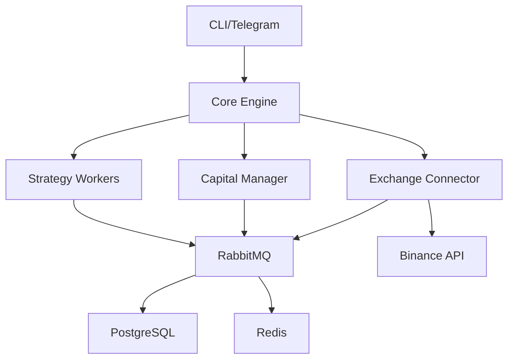

# Letrade_v1

마이크로서비스 아키텍처로 밑바닥부터 만든 암호화폐 자동거래 시스템. Freqtrade 같은 기존 프레임워크 없이 메시지버스 기반으로 직접 설계했다. 2025-06에 5일간 집중 개발해 인프라 MVP를 완성했고, 이후 개발 중단 상태로 보존 중이다.

[](https://www.python.org/downloads/)
[](LICENSE)

## 현재 상태

- 인프라 계층(메시지버스·거래소 연동·자본관리·운영 인터페이스)은 MVP 완료
- 전략 계층은 레퍼런스 구현(MA crossover) 단계에서 중단 — 시스템은 완성됐지만 "무엇을 거래할지"는 별도 연구 과제로 남음
- 실거래 이력 없음 (testnet / dry-run)

## 아키텍처


```mermaid
graph TD
    A[CLI/Telegram] --> B[Core Engine]
    B --> C[Strategy Workers]
    B --> D[Capital Manager]
    B --> E[Exchange Connector]

    C --> F[RabbitMQ]
    D --> F
    E --> F

    F --> G[PostgreSQL]
    F --> H[Redis]

    E --> I[Binance API]
```

- **Core Engine** — 오케스트레이터. 서비스 기동/중지, 헬스체크
- **Strategy Workers** — 전략별 독립 프로세스 (multiprocessing 격리)
- **Capital Manager** — 거래 제안을 검증·승인하고 최종 주문 크기를 결정하는 게이트키퍼
- **Exchange Connector** — CCXT 추상화 + WebSocket 실시간 데이터, Circuit Breaker 장애 복구
- 서비스 간 통신은 전부 RabbitMQ 토픽 익스체인지 (`market_data.binance.btcusdt` 형식)

## 성능 (개발 문서 기준)

아래는 개발 당시 벤치마크 문서에 기록된 수치다. 대부분 실측 재현 스크립트가 저장소에 남아있지 않아, 실측치가 아니라 문서상 집계·설계 목표임을 밝혀둔다.

| 항목 | 수치 | 성격 |
|---|---|---|
| 거래 실행 경로 | 0.86ms | 컴포넌트 지연 합산 추정 (report-performance-achievement.md) |
| 메시지 처리량 | 15,000 msg/sec | 벤치마크 문서 주장 |
| 연속 안정성 테스트 | 8.92시간 / 31,989 연산 / 성공률 99.90% | 실행 로그 (report-mvp-completion.md) |
| 테스트 | pytest 수집 함수 약 168개 (문서 집계로는 232케이스) | 실측/문서 |
| 커버리지 | 전체 약 74% (목표 85%, Common 모듈 한정 85%) | 실측/목표 |

`99.9%`는 시스템 가용성(uptime)이 아니라 연속 테스트의 연산 성공률이다. 24시간 연속 드라이런은 계획 단계에서 중단됐다.

## 빠른 시작

```bash
git clone https://github.com/LETUED/LETRADE_V1.git
cd LETRADE_V1
./scripts/development/setup_dev_env.sh   # venv + 의존성 + Docker(PostgreSQL/RabbitMQ/Redis) + 마이그레이션
cp .env.example .env                     # API 키 입력
python -m src.core_engine.main
```

## 프로젝트 구조

```
src/
  core_engine/          메인 오케스트레이터
  strategies/           거래 전략 (BaseStrategy + MA crossover)
  capital_manager/      리스크·자본 관리
  exchange_connector/   거래소 API 연동 (CCXT/WebSocket)
  common/               메시지버스 등 공통 모듈
tests/                  단위 테스트 (통합 테스트는 현재 .disabled)
docs/                   설계·API·보고서 (기능별 분류)
migrations/             Alembic DB 마이그레이션
scripts/                개발·배포 스크립트
```

## 전략 추가

```python
from src.strategies.base_strategy import BaseStrategy

class MyStrategy(BaseStrategy):
    def populate_indicators(self, dataframe):
        return dataframe

    def on_data(self, data, dataframe):
        return trade_signal

    def get_required_subscriptions(self):
        return ["market_data.binance.btcusdt"]
```

## 테스트

```bash
docker-compose up -d              # 통합용 인프라 (RabbitMQ / PostgreSQL / Redis)
pytest tests/unit                 # 단위 테스트
pytest --cov=src --cov-report=html
```

실인프라 통합 테스트(`tests/test_exchange_connector_integration.py`)는 현재 `.disabled` 상태다.
코드 스타일: black + isort + mypy + flake8 (pre-commit 훅).

## 모니터링

```bash
docker-compose up -d              # RabbitMQ / PostgreSQL / Redis
```

- RabbitMQ 관리 UI: :15672 / Prometheus: :9090 / Grafana: :3000
- GCP Cloud Run 배포·Secret Manager 연동은 설계 단계 (`docs/deployment/`, `docs/security/`)

## 문서

- [docs/README.md](docs/README.md) — 문서 탐색 시작점
- [시스템 아키텍처](docs/architecture/design-system-architecture-v2.md)
- [MVP 기능 명세](docs/core/mvp/MVP%20통합%20기능명세서.md)
- [성능 보고서](docs/monitoring/report-performance-achievement.md)

## 라이선스

MIT — [LICENSE](LICENSE)
