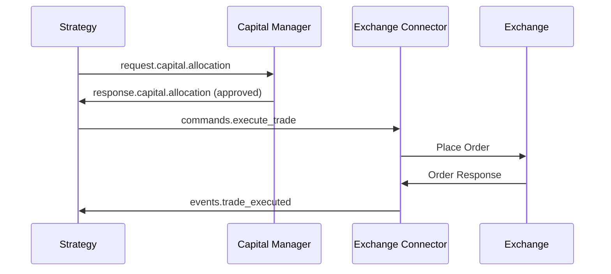
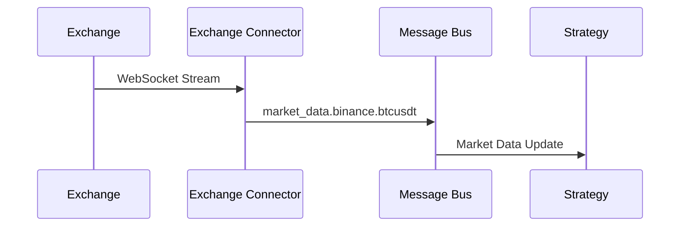

# Message Bus API 문서

## 개요

Letrade_v1은 RabbitMQ 기반 메시지 버스를 사용하여 마이크로서비스 간 통신을 구현합니다.

## 메시지 형식

모든 메시지는 다음 형식을 따릅니다:

```json
{
  "message_id": "550e8400-e29b-41d4-a716-446655440000",
  "timestamp": "2024-01-01T10:00:00.000Z",
  "source": "core_engine",
  "payload": {
    // 메시지별 데이터
  }
}
```

## Exchange와 Routing Key

### Exchange 구조
- `letrade.commands`: 명령 메시지
- `letrade.events`: 이벤트 메시지
- `letrade.requests`: 요청/응답 메시지

## 주요 메시지 타입

### 1. 거래 명령 (Commands)

#### 거래 실행 명령
**Routing Key**: `commands.execute_trade`

**Payload**:
```json
{
  "strategy_id": 123,
  "exchange": "binance",
  "symbol": "BTC/USDT",
  "side": "buy",
  "type": "market",
  "amount": 0.01,
  "price": 50000.0,
  "stop_loss": 49000.0,
  "take_profit": 55000.0,
  "client_order_id": "strategy_123_001"
}
```

#### 주문 취소 명령
**Routing Key**: `commands.cancel_order`

**Payload**:
```json
{
  "order_id": "12345",
  "symbol": "BTC/USDT",
  "exchange": "binance"
}
```

### 2. 이벤트 (Events)

#### 거래 실행 완료
**Routing Key**: `events.trade_executed`

**Payload**:
```json
{
  "strategy_id": 123,
  "order_id": "12345",
  "symbol": "BTC/USDT",
  "side": "buy",
  "type": "market",
  "amount": 0.01,
  "filled": 0.01,
  "status": "filled",
  "average_price": 50100.0,
  "cost": 501.0,
  "fee": 0.501,
  "timestamp": "2024-01-01T10:00:00.000Z",
  "exchange": "binance"
}
```

#### 시장 데이터 업데이트
**Routing Key**: `market_data.{exchange}.{symbol}`
예: `market_data.binance.btcusdt`

**Payload**:
```json
{
  "symbol": "BTC/USDT",
  "timestamp": "2024-01-01T10:00:00.000Z",
  "open": 50000.0,
  "high": 51000.0,
  "low": 49500.0,
  "close": 50500.0,
  "volume": 1234.56,
  "exchange": "binance"
}
```

#### 에러 이벤트
**Routing Key**: `events.error`

**Payload**:
```json
{
  "error_type": "trade_execution_failed",
  "error_message": "Insufficient balance",
  "context": {
    "strategy_id": 123,
    "symbol": "BTC/USDT",
    "requested_amount": 1.0
  },
  "timestamp": "2024-01-01T10:00:00.000Z"
}
```

### 3. 요청/응답 (Request/Response)

#### 자본 할당 요청
**Routing Key**: `request.capital.allocation`

**Request Payload**:
```json
{
  "strategy_id": 123,
  "symbol": "BTC/USDT",
  "side": "buy",
  "quantity": 0.01,
  "price": 50000.0,
  "stop_loss": 49000.0,
  "take_profit": 52000.0
}
```

**Response Routing Key**: `response.capital.allocation`

**Response Payload**:
```json
{
  "request_id": "req_123",
  "result": "approved",
  "approved_quantity": 0.01,
  "risk_level": "medium",
  "reasons": [],
  "suggested_stop_loss": 49000.0,
  "suggested_take_profit": 52000.0,
  "portfolio_impact": {
    "position_size_percent": 5.0,
    "new_portfolio_risk_percent": 15.0,
    "available_capital_after": 4500.0
  }
}
```

#### 시장 데이터 요청
**Routing Key**: `request.market_data`

**Request Payload**:
```json
{
  "symbol": "BTC/USDT",
  "timeframe": "1m",
  "limit": 100,
  "request_id": "req_001"
}
```

**Response Routing Key**: `response.market_data`

**Response Payload**:
```json
{
  "request_id": "req_001",
  "symbol": "BTC/USDT",
  "timeframe": "1m",
  "data": [
    {
      "timestamp": "2024-01-01T10:00:00Z",
      "open": 50000,
      "high": 50100,
      "low": 49900,
      "close": 50050,
      "volume": 10.5
    }
  ]
}
```

## 메시지 흐름 예시

### 거래 실행 플로우



### 실시간 데이터 플로우



## 구독 패턴

### 와일드카드 구독
```python
# 모든 Binance 시장 데이터
await message_bus.subscribe("market_data.binance.*")

# 모든 거래 이벤트
await message_bus.subscribe("events.trade_*")

# 특정 전략의 모든 메시지
await message_bus.subscribe("*.strategy_123.*")
```

### 메시지 필터링
```python
async def message_handler(topic: str, message: dict):
    # 메시지 필터링
    if message.get('symbol') != 'BTC/USDT':
        return
    
    # 처리 로직
    process_message(message)
```

## 에러 처리

### Dead Letter Queue
실패한 메시지는 DLQ로 라우팅됩니다:
- Exchange: `letrade.dlq`
- Routing Key: 원본 routing key + `.dead`

### 재시도 정책
```json
{
  "x-max-retries": 3,
  "x-retry-delay": 5000,
  "x-backoff-multiplier": 2
}
```

## 성능 고려사항

### 메시지 크기
- 최대 메시지 크기: 128KB
- 대용량 데이터는 참조 ID 사용

### 처리량
- 예상 처리량: 10,000 msg/s
- 배치 처리 권장

### 지연시간
- 평균 지연시간: < 5ms
- 거래 메시지 우선순위: HIGH

## 모니터링

### 메트릭
- 메시지 처리율
- 큐 깊이
- 처리 지연시간
- 에러율

### 헬스체크
```python
# 메시지 버스 상태 확인
health = await message_bus.health_check()
print(f"Status: {health['status']}")
print(f"Queue depth: {health['queue_depth']}")
```

## 보안

### 인증
- 메시지에 JWT 토큰 포함
- 서명 검증

### 암호화
- TLS 연결 필수
- 민감한 데이터 암호화

## 예제 코드

### Publisher
```python
from src.common.message_bus import MessageBus

async def publish_trade_command():
    bus = MessageBus()
    await bus.connect()
    
    message = {
        "strategy_id": 123,
        "symbol": "BTC/USDT",
        "side": "buy",
        "amount": 0.01
    }
    
    await bus.publish(
        "letrade.commands",
        "execute_trade",
        message
    )
```

### Subscriber
```python
async def handle_trade_event(topic: str, message: dict):
    print(f"Trade executed: {message}")

async def subscribe_to_trades():
    bus = MessageBus()
    await bus.connect()
    
    await bus.subscribe(
        "events.trade_executed",
        handle_trade_event
    )
```