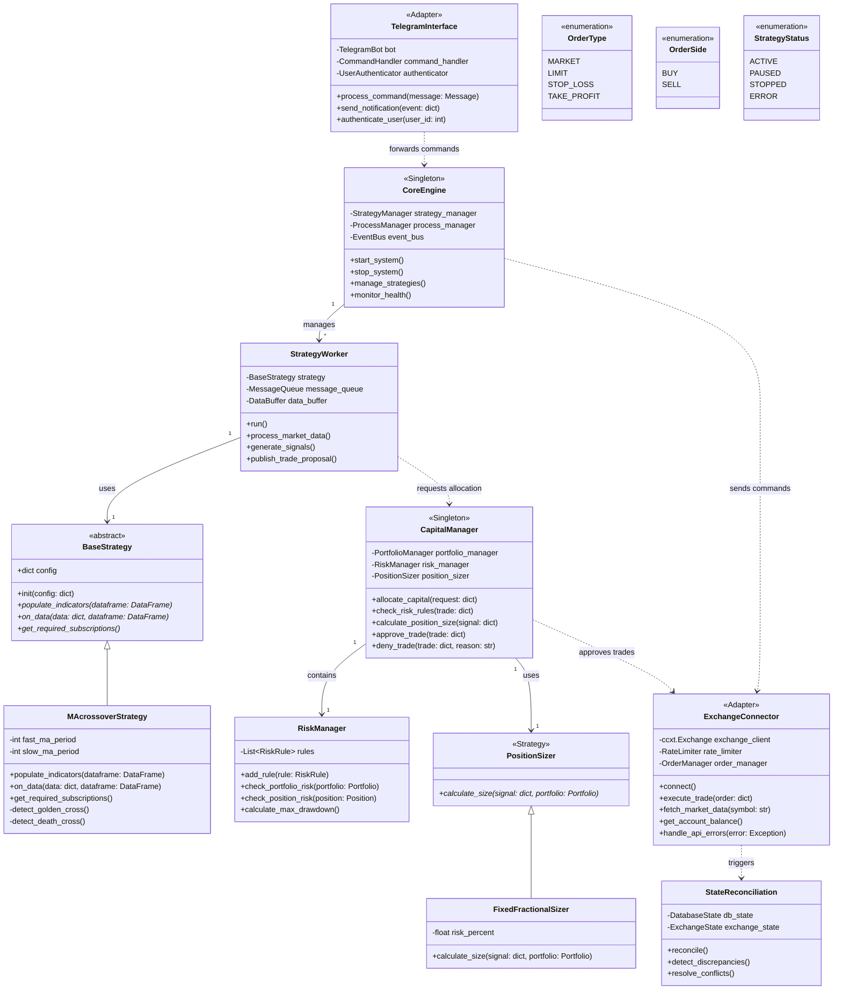

# MVP 클래스 다이어그램

```mermaid
classDiagram
    %% Core System Classes
    class BaseStrategy {
        <<abstract>>
        +dict config
        +init(config: dict)
        +populate_indicators(dataframe: DataFrame)*
        +on_data(data: dict, dataframe: DataFrame)*
        +get_required_subscriptions()*
    }
    
    class MAcrossoverStrategy {
        -int fast_ma_period
        -int slow_ma_period
        +populate_indicators(dataframe: DataFrame)
        +on_data(data: dict, dataframe: DataFrame)
        +get_required_subscriptions()
        -detect_golden_cross()
        -detect_death_cross()
    }
    
    class CoreEngine {
        <<Singleton>>
        -StrategyManager strategy_manager
        -ProcessManager process_manager
        -EventBus event_bus
        +start_system()
        +stop_system()
        +manage_strategies()
        +monitor_health()
    }
    
    class StrategyWorker {
        -BaseStrategy strategy
        -MessageQueue message_queue
        -DataBuffer data_buffer
        +run()
        +process_market_data()
        +generate_signals()
        +publish_trade_proposal()
    }
    
    class CapitalManager {
        <<Singleton>>
        -PortfolioManager portfolio_manager
        -RiskManager risk_manager
        -PositionSizer position_sizer
        +allocate_capital(request: dict)
        +check_risk_rules(trade: dict)
        +calculate_position_size(signal: dict)
        +approve_trade(trade: dict)
        +deny_trade(trade: dict, reason: str)
    }
    
    class ExchangeConnector {
        <<Adapter>>
        -ccxt.Exchange exchange_client
        -RateLimiter rate_limiter
        -OrderManager order_manager
        +connect()
        +execute_trade(order: dict)
        +fetch_market_data(symbol: str)
        +get_account_balance()
        +handle_api_errors(error: Exception)
    }
    
    class TelegramInterface {
        <<Adapter>>
        -TelegramBot bot
        -CommandHandler command_handler
        -UserAuthenticator authenticator
        +process_command(message: Message)
        +send_notification(event: dict)
        +authenticate_user(user_id: int)
    }
    
    class RiskManager {
        -List~RiskRule~ rules
        +add_rule(rule: RiskRule)
        +check_portfolio_risk(portfolio: Portfolio)
        +check_position_risk(position: Position)
        +calculate_max_drawdown()
    }
    
    class PositionSizer {
        <<Strategy>>
        +calculate_size(signal: dict, portfolio: Portfolio)*
    }
    
    class FixedFractionalSizer {
        -float risk_percent
        +calculate_size(signal: dict, portfolio: Portfolio)
    }
    
    class StateReconciliation {
        -DatabaseState db_state
        -ExchangeState exchange_state
        +reconcile()
        +detect_discrepancies()
        +resolve_conflicts()
    }
    
    %% Relationships
    BaseStrategy <|-- MAcrossoverStrategy
    PositionSizer <|-- FixedFractionalSizer
    
    CoreEngine "1" --> "*" StrategyWorker : manages
    StrategyWorker "1" --> "1" BaseStrategy : uses
    CapitalManager "1" --> "1" RiskManager : contains
    CapitalManager "1" --> "1" PositionSizer : uses
    
    CoreEngine ..> ExchangeConnector : sends commands
    StrategyWorker ..> CapitalManager : requests allocation
    CapitalManager ..> ExchangeConnector : approves trades
    TelegramInterface ..> CoreEngine : forwards commands
    
    ExchangeConnector ..> StateReconciliation : triggers
    
    %% Enumerations
    class OrderType {
        <<enumeration>>
        MARKET
        LIMIT
        STOP_LOSS
        TAKE_PROFIT
    }
    
    class OrderSide {
        <<enumeration>>
        BUY
        SELL
    }
    
    class StrategyStatus {
        <<enumeration>>
        ACTIVE
        PAUSED
        STOPPED
        ERROR
    }
```