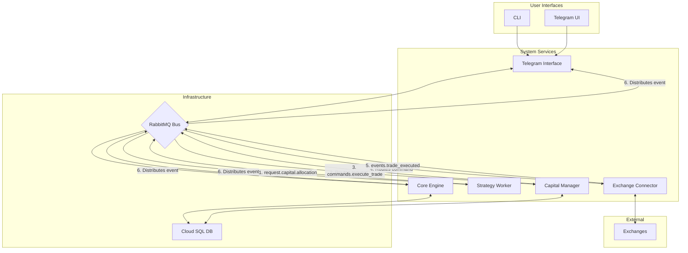

# 자본 및 리스크 관리 (Capital and Risk Management)

## 📋 문서 개요

**문서 목적**: 자동 암호화폐 거래 시스템의 재무적 안정성과 확장성을 보장하는 핵심 구성 요소인 자금 및 리스크 관리 모듈의 상세 설계 명세서

**시스템 진화**: 
- **기존**: 개별 전략 실행과 거래소 연동에 중점
- **목표**: 소규모 투자부터 기관급 대규모 자본 운용까지 포괄하는 정교한 중앙 집중화된 자금 관리 체계

**핵심 가치**: 시스템을 단순한 거래 실행 도구에서 **지능적인 포트폴리오 관리 플랫폼**으로 격상

---

## 🏗️ 1. 아키텍처 진화: Capital Manager 서비스 도입

### 1.1 설계 배경 및 필요성

**기존 구조의 한계**:
- ❌ Strategy Worker → Exchange Connector 직접 연결
- ❌ 포트폴리오 수준 리스크 관리 부재
- ❌ 단일 책임 원칙(SRP) 위배 위험

**해결 방안**:
- ✅ **Capital Manager** 마이크로서비스 신규 도입
- ✅ 자본 할당 및 포트폴리오 리스크 관리의 중앙 허브
- ✅ 모든 거래 흐름을 통제하는 핵심 게이트키퍼

### 1.2 아키텍처 변화: 기존 vs 신규

#### **기존 구조**:
```
Strategy Worker → 거래 신호 생성 → Exchange Connector → 직접 주문 실행
```

#### **신규 구조**:
```
Strategy Worker → 거래 '제안' 생성 → Capital Manager → 검토/승인/규모 결정 → Exchange Connector → 주문 실행
```

### 1.3 Capital Manager: 새로운 중앙 권한

**핵심 정의**: 시스템 내에서 자본과 관련된 모든 의사결정을 내리는 **유일한 주체**

#### 🎯 **핵심 책임 (5대 영역)**

#### **1. 포트폴리오 상태 관리**
- **역할**: 모든 자본 풀(Capital Pool)과 하위 포트폴리오 실시간 추적
- **관리 데이터**: 총 자본, 가용 자본, 현재 손익
- **영속화**: 데이터베이스에 실시간 상태 저장

#### **2. 자본 할당 요청 처리**
- **입력**: Strategy Worker로부터의 거래 신호 기반 자본 할당 요청
- **처리**: 요청 검증 및 승인/거부 결정

#### **3. 포트폴리오 리스크 규칙 강제**
- **적용 범위**: 포트폴리오 수준에서 정의된 모든 리스크 규칙
- **규칙 예시**: 최대 손실률, 자산별 최대 노출도
- **결과**: 규칙 위반 거래 자동 거부

#### **4. 포지션 규모 결정**
- **기반**: 각 전략에 사전 구성된 포지션 사이징 모델
- **모델 종류**: 고정 비율, 켈리 기준, 변동성 기반
- **산출**: 최종 주문 수량 계산

#### **5. 주문 실행 명령 발행**
- **조건**: 모든 검증 절차 통과한 거래에 대해서만
- **내용**: 최종 파라미터 (심볼, 수량, 가격 등)
- **대상**: Exchange Connector가 구독하는 큐로 `commands.execute_trade` 메시지 발행

### 1.4 설계 효과

**안전장치**: 단일 불량 전략이 전체 포트폴리오를 위험에 빠뜨리는 것을 원천적으로 방지
**필수성**: 대규모 자금 운용을 위한 필수적인 아키텍처 패턴
**분리**: 개별 전략의 논리와 포트폴리오 전체의 리스크 관리 명확 분리

---

## 📡 2. 진화된 데이터 흐름 및 메시징

### 2.1 핵심 변화

**목표**: Capital Manager 도입에 따른 RabbitMQ 메시지 버스 데이터 흐름 재정의
**원칙**: 시스템의 **비동기적 특성**과 **복원력** 유지하면서 새로운 기능 통합

### 2.2 신규 메시지 유형

#### 📤 **request.capital.allocation**
**발행자**: Strategy Worker (거래 신호 생성 시)
**의미**: 직접적인 주문 명령이 아닌, 자본 할당을 위한 '요청'

```json
{
  "routing_key": "request.capital.allocation.{strategy_id}",
  "payload": {
    "strategy_id": 123,
    "symbol": "BTC/USDT",
    "side": "buy",
    "entry_price": 50000.0,
    "stop_loss_price": 48000.0,
    "strategy_params": {...}
  }
}
```

#### ✅ **event.capital.approved**
**발행자**: Capital Manager (자본 할당 요청 승인 시)
**의미**: 기존 `commands.execute_trade` 메시지 대체

```json
{
  "routing_key": "commands.execute_trade",
  "payload": {
    "strategy_id": 123,
    "symbol": "BTC/USDT",
    "side": "buy",
    "type": "market",
    "amount": 0.1,
    "price": 50000.0
  }
}
```

#### ❌ **event.capital.denied**
**발행자**: Capital Manager (요청 거부 시)
**의미**: 포트폴리오 리스크 규칙 위반 등으로 인한 거부

```json
{
  "routing_key": "event.capital.denied.{strategy_id}",
  "payload": {
    "strategy_id": 123,
    "reason": "Max drawdown limit exceeded",
    "request_payload": {...}
  }
}
```

### 2.3 진화된 데이터 흐름 다이어그램



### 2.4 단계별 데이터 흐름

1. **신호 생성 및 자본 요청**: Strategy Worker → `request.capital.allocation` → RabbitMQ
2. **자본 관리자 수신**: Capital Manager ← RabbitMQ
3. **승인 및 주문 명령**: Capital Manager → 검증 → 포지션 규모 계산 → `commands.execute_trade` → RabbitMQ
4. **거래 실행기 수신**: Exchange Connector ← RabbitMQ
5. **거래 실행 및 이벤트 발행**: Exchange Connector → 거래소 주문 → `events.trade_executed` → RabbitMQ
6. **상태 업데이트**: Strategy Worker, Core Engine, Telegram Interface ← 거래 완료 이벤트

---

## 🏛️ 3. 계층적 포트폴리오 관리

### 3.1 설계 목적

**요구사항**: 소규모 투자부터 대규모 투자까지 모두 처리
**구현**: 데이터베이스가 자본의 계층 구조와 관련 규칙을 명확하게 표현

### 3.2 데이터 모델 확장

#### 📊 **신규 테이블: portfolios**

**목적**: 자본을 관리하는 최상위 단위
**특징**: 계층 구조 지원 ('글로벌' 포트폴리오 → '현물', '선물', '실험적 전략' 하위 포트폴리오)

| 컬럼명 | 데이터 타입 | 제약조건 | 설명 |
|--------|-------------|----------|------|
| `id` | SERIAL | PRIMARY KEY | 포트폴리오 고유 ID |
| `name` | VARCHAR(255) | NOT NULL | 포트폴리오 이름 (예: "Global", "Futures High-Risk") |
| `parent_id` | INTEGER | FK to portfolios.id | 상위 포트폴리오 ID (계층 구조 지원) |
| `total_capital` | NUMERIC(20, 8) | NOT NULL | 이 포트폴리오에 할당된 총 자본 (기준 통화 기준) |
| `available_capital` | NUMERIC(20, 8) | NOT NULL | 현재 거래에 사용 가능한 자본 |
| `is_active` | BOOLEAN | DEFAULT TRUE | 포트폴리오 활성화 여부 |

#### 📋 **신규 테이블: portfolio_rules**

**목적**: 각 포트폴리오에 적용될 리스크 관리 규칙 정의
**특징**: `rule_type`과 `rule_value`를 통한 유연한 규칙 추가

| 컬럼명 | 데이터 타입 | 제약조건 | 설명 |
|--------|-------------|----------|------|
| `id` | SERIAL | PRIMARY KEY | 규칙 고유 ID |
| `portfolio_id` | INTEGER | FK to portfolios.id | 규칙이 적용될 포트폴리오 ID |
| `rule_type` | VARCHAR(50) | NOT NULL | 규칙 유형 (예: 'MAX_DRAWDOWN_PERCENT') |
| `rule_value` | JSONB | NOT NULL | 규칙 값 (예: {"value": 15}) |

#### 🔗 **신규 테이블: strategy_portfolio_map**

**목적**: 전략과 포트폴리오 간의 명시적 연결
**효과**: 특정 전략이 지정된 자본 풀 내에서만 운영되도록 강제

| 컬럼명 | 데이터 타입 | 제약조건 | 설명 |
|--------|-------------|----------|------|
| `strategy_id` | INTEGER | FK to strategies.id | 전략 ID |
| `portfolio_id` | INTEGER | FK to portfolios.id | 포트폴리오 ID |

#### ⚙️ **수정 테이블: strategies**

**추가 컬럼**: 포지션 사이징 설정

| 컬럼명 | 데이터 타입 | 제약조건 | 설명 |
|--------|-------------|----------|------|
| ...... | ...... | ...... | (기존 컬럼들) |
| `position_sizing_config` | JSONB | NULL | 포지션 사이징 모델 및 파라미터 (예: {"model": "Kelly", "fraction": 0.5}) |

---

## 📏 4. 포지션 사이징 알고리즘

### 4.1 개요

**목적**: 리스크 검증을 통과한 거래 요청에 대해 주문 크기 계산
**기반**: `strategies` 테이블의 `position_sizing_config`에 정의된 모델
**가치**: 모든 투자 규모에 대응하고 다양한 투자 방식 지원

### 4.2 알고리즘 상세

#### 💰 **4.2.1 고정 비율(Fixed Fractional) 사이징**

**특징**: 가장 기본적이고 안정적인 모델
**원리**: 포트폴리오 가용 자본의 정해진 비율(예: 1% 또는 2%)만큼만 리스크 감수

**계산식**:
```
Position Size = (Portfolio Available Capital × Risk Percent) / Stop Loss Distance
```

**구현 요구사항**:
- `stop_loss_price`는 `request.capital.allocation` 메시지에 포함 필수
- 리스크를 일정하게 유지하여 안정적인 자본 관리 실현

**설정 예시**:
```json
{
  "model": "fixed_fractional",
  "risk_percent": 0.02
}
```

#### 📊 **4.2.2 변동성 기반(Volatility-Adjusted) 사이징**

**원리**: 시장 변동성에 따라 포지션 크기를 동적 조절
- **높은 변동성**: 포지션 크기 감소
- **낮은 변동성**: 포지션 크기 증가
- **결과**: 리스크 노출을 일정하게 유지

**주요 지표**: 평균 실제 범위(Average True Range, ATR)

**구현 프로세스**:
1. Capital Manager → Exchange Connector에 최근 OHLCV 데이터 요청
2. ATR 계산
3. Stop Loss Distance 대신 ATR 사용하여 포지션 크기 정규화

**설정 예시**:
```json
{
  "model": "volatility_adjusted",
  "atr_period": 14,
  "volatility_multiplier": 2.0
}
```

#### 🎯 **4.2.3 켈리 기준(Kelly Criterion)**

**목표**: 장기적인 자본 성장률을 수학적으로 극대화
**기반**: 전략의 과거 성과 데이터

**핵심 입력값**:
- **p (승률, Win Probability)**: 해당 전략의 과거 거래 중 수익을 낸 거래의 비율
- **R (손익비, Win/Loss Ratio)**: 평균 수익 금액 ÷ 평균 손실 금액

**계산식**:
```
f = p - (1-p)/R
```
*여기서 f는 포트폴리오 자본 중 베팅할 비율*

**구현 방법**:
```python
def calculate_kelly_fraction(strategy_id):
    # trades 테이블에서 특정 strategy_id 거래 내역 분석
    # p (승률)와 R (손익비) 계산
    # 켈리 비율 f 반환
```

#### ⚠️ **핵심 고려사항: 분할 켈리(Fractional Kelly)**

**위험성**: 암호화폐 시장의 높은 변동성과 예측 불가능성
**문제**: 승률 과대평가 시 큰 손실 위험
**해결책**: 계산된 f값에 0.25나 0.5 같은 분수(fraction) 곱하여 베팅 크기 감소

**권장 설정**:
```json
{
  "model": "Kelly",
  "fraction": 0.5
}
```

**절대적 권장사항**: 분할 켈리 방식 적용 필수

#### 🤖 **4.2.4 머신러닝 기반 동적 사이징 (신규 추가)**

**목표**: 시장 조건, 전략 성과, 포트폴리오 상태를 종합적으로 고려한 지능형 포지션 사이징

**입력 특성**:
- 시장 변동성 (VIX, 암호화폐 공포 탐욕 지수)
- 전략 최근 성과 (승률, 샤프 지수, 최대 손실률)
- 포트폴리오 현재 상태 (노출도, 상관관계)
- 거시경제 지표 (금리, 달러 지수 등)

**모델 구조**:
```python
class MLPositionSizer:
    def __init__(self):
        self.model = self.load_trained_model()
        self.feature_engineer = FeatureEngineer()
        self.risk_adjuster = RiskAdjuster()
    
    def calculate_position_size(self, strategy_id: int, signal: dict) -> float:
        # 특성 생성
        features = self.feature_engineer.create_features(
            strategy_id=strategy_id,
            market_data=signal['market_data'],
            portfolio_state=self.get_portfolio_state()
        )
        
        # ML 모델 예측
        predicted_size_ratio = self.model.predict(features.reshape(1, -1))[0]
        
        # 리스크 조정
        adjusted_ratio = self.risk_adjuster.apply_constraints(
            predicted_size_ratio, strategy_id
        )
        
        return adjusted_ratio
    
    def update_model(self, recent_trades: List[Dict]):
        """
        최근 거래 결과를 바탕으로 모델 재학습
        """
        if len(recent_trades) >= 100:  # 충분한 데이터 확보 시
            X, y = self.prepare_training_data(recent_trades)
            self.model.partial_fit(X, y)  # 온라인 학습
```

**특징**:
- **적응성**: 시장 조건 변화에 자동 적응
- **개인화**: 각 전략의 고유한 특성 학습
- **리스크 인식**: 불확실성이 높을 때 보수적 접근

### 4.3 시스템 지원 범위

**투자 스타일 수용 범위**:
- ✅ 단순한 반복 매매
- ✅ 정교한 통계적 베팅 전략
- ✅ 소규모부터 대규모까지 모든 자본 규모
- ✅ AI 기반 적응형 포지션 관리

---

## 🎯 5. 고급 리스크 관리 기능 (신규 추가)

### 5.1 상관관계 기반 포트폴리오 최적화

**목적**: 개별 전략의 상관관계를 고려한 포트폴리오 수준 리스크 관리

```python
class CorrelationBasedRiskManager:
    def __init__(self):
        self.correlation_matrix = None
        self.update_interval = 24 * 3600  # 24시간마다 업데이트
        
    def calculate_portfolio_risk(self, proposed_allocations: Dict[int, float]) -> float:
        """
        제안된 포지션 할당에 대한 포트폴리오 전체 리스크 계산
        """
        if self.correlation_matrix is None:
            self.update_correlation_matrix()
        
        # 각 전략의 예상 변동성
        volatilities = self.get_strategy_volatilities(proposed_allocations.keys())
        
        # 포트폴리오 변동성 계산 (마코위츠 모델)
        portfolio_variance = 0
        for i, (strategy_i, weight_i) in enumerate(proposed_allocations.items()):
            for j, (strategy_j, weight_j) in enumerate(proposed_allocations.items()):
                correlation = self.correlation_matrix[i][j]
                portfolio_variance += (
                    weight_i * weight_j * 
                    volatilities[strategy_i] * volatilities[strategy_j] * 
                    correlation
                )
        
        return math.sqrt(portfolio_variance)
    
    def suggest_optimal_allocation(self, requested_allocations: Dict[int, float]) -> Dict[int, float]:
        """
        리스크-수익 최적화를 통한 할당 조정 제안
        """
        # 제약 조건 하에서 샤프 지수 최대화
        constraints = [
            {'type': 'eq', 'fun': lambda x: sum(x) - 1},  # 총 할당 = 100%
            {'type': 'ineq', 'fun': lambda x: 0.15 - self.calculate_portfolio_risk(x)}  # 최대 리스크 15%
        ]
        
        result = minimize(
            fun=self.negative_sharpe_ratio,
            x0=list(requested_allocations.values()),
            method='SLSQP',
            constraints=constraints,
            bounds=[(0, 0.5) for _ in requested_allocations]  # 개별 전략 최대 50%
        )
        
        return dict(zip(requested_allocations.keys(), result.x))
```

### 5.2 동적 리스크 예산 관리

**개념**: 시장 조건에 따라 전체 포트폴리오의 리스크 예산을 동적으로 조정

```python
class DynamicRiskBudgetManager:
    def __init__(self):
        self.market_regime_detector = MarketRegimeDetector()
        self.base_risk_budget = 0.02  # 기본 2% 리스크
        
    def get_current_risk_budget(self) -> float:
        """
        현재 시장 상황에 맞는 리스크 예산 계산
        """
        market_regime = self.market_regime_detector.detect_current_regime()
        
        risk_multipliers = {
            'bull_market': 1.2,      # 상승장: 20% 증가
            'bear_market': 0.6,      # 하락장: 40% 감소
            'sideways': 1.0,         # 횡보: 기본값
            'high_volatility': 0.5,  # 고변동성: 50% 감소
            'low_volatility': 1.1    # 저변동성: 10% 증가
        }
        
        multiplier = risk_multipliers.get(market_regime, 1.0)
        adjusted_budget = self.base_risk_budget * multiplier
        
        # 안전 범위 제한
        return max(0.005, min(0.05, adjusted_budget))  # 0.5% ~ 5% 범위
```

### 5.3 실시간 VaR (Value at Risk) 모니터링

**목적**: 포트폴리오의 잠재적 손실을 실시간으로 모니터링

```python
class RealTimeVaRMonitor:
    def __init__(self, confidence_level=0.95):
        self.confidence_level = confidence_level
        self.historical_window = 252  # 1년간 데이터
        
    def calculate_portfolio_var(self, positions: Dict[str, float]) -> Dict[str, float]:
        """
        몬테카를로 시뮬레이션을 통한 VaR 계산
        """
        # 과거 수익률 데이터 수집
        returns_data = self.get_historical_returns(positions.keys())
        
        # 몬테카를로 시뮬레이션
        num_simulations = 10000
        portfolio_returns = []
        
        for _ in range(num_simulations):
            # 랜덤 시나리오 생성
            scenario_returns = self.generate_random_scenario(returns_data)
            
            # 포트폴리오 수익률 계산
            portfolio_return = sum(
                positions[asset] * scenario_returns[asset] 
                for asset in positions
            )
            portfolio_returns.append(portfolio_return)
        
        # VaR 계산
        sorted_returns = sorted(portfolio_returns)
        var_index = int((1 - self.confidence_level) * len(sorted_returns))
        
        return {
            'var_1day': sorted_returns[var_index],
            'var_1week': sorted_returns[var_index] * math.sqrt(7),
            'var_1month': sorted_returns[var_index] * math.sqrt(30),
            'expected_shortfall': sum(sorted_returns[:var_index]) / var_index
        }
```

---

## 🎯 시스템 통합 효과

### 핵심 가치 실현
- **재무적 안정성**: 중앙 집중식 리스크 관리
- **확장성**: 소규모부터 기관급까지 대응
- **유연성**: 다양한 포지션 사이징 모델 지원
- **안전성**: 포트폴리오 수준 리스크 규칙 강제
- **지능성**: ML 기반 적응형 리스크 관리

### 시스템 진화
**이전**: 단순한 거래 실행 도구  
**이후**: 지능적인 포트폴리오 관리 플랫폼

### 고급 기능 추가 효과
- **AI 기반 의사결정**: 머신러닝 모델을 통한 최적 포지션 사이징
- **동적 적응성**: 시장 조건 변화에 자동 대응
- **포트폴리오 최적화**: 현대 포트폴리오 이론 적용
- **실시간 리스크 모니터링**: VaR 기반 손실 위험 감시

---

## 📝 문서 관리 정보

**연관 문서**: 
- `00_System_Overview_and_Architecture.md`
- `01_Core_Services_and_Execution_Framework.md`

**구현 우선순위**: 
1. Capital Manager 서비스 구현
2. 데이터 모델 확장
3. 기본 포지션 사이징 알고리즘 구현
4. ML 기반 고급 기능 추가

**리스크 관리**: 분할 켈리 방식 적용 필수, AI 모델 신중한 검증 필요