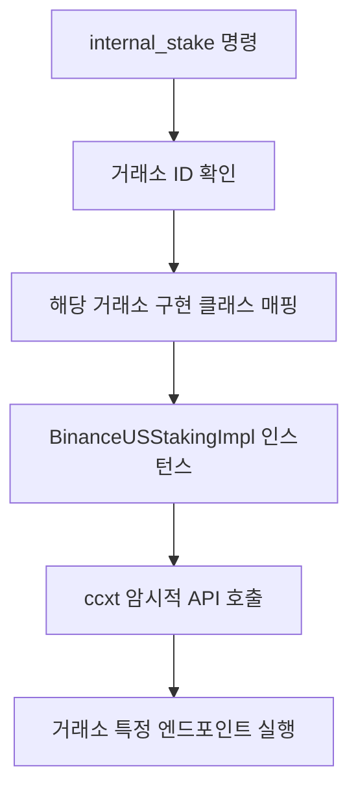

# 거래 기능 및 수익 창출 (Trading Functions and Yield Generation)

## 📋 문서 개요

**문서 목적**: 자동 암호화폐 거래 시스템이 지원하는 구체적인 금융 상품 및 투자 활동의 구현 세부 사항을 기술

**핵심 서비스**: Exchange Connector - 외부 거래소와의 모든 상호작용을 중앙에서 처리하는 게이트웨이

**주요 내용**:
- 🏪 **핵심 거래 기능**: 현물 및 선물 거래 구현
- 💰 **수익 창출 모듈**: 스테이킹 등 비표준화된 수익 창출 상품 지원
- 🔧 **확장 가능한 추상화 계층**: 다양한 금융 상품의 안정적 통합

**대상 독자**: 퀀트 개발자, 시스템 엔지니어

---

## 🏪 1. 핵심 거래 기능 (Core Trading Functions)

### 1.1 시스템 설계 원칙

**중앙 집중식 관리**: 시스템의 모든 거래 실행은 Exchange Connector 서비스를 통해 중앙에서 관리

**추상화 계층**: ccxt 라이브러리를 활용하여 거래소별 API 복잡성을 추상화하고, 상위 서비스에 일관된 인터페이스 제공

### 1.2 ccxt를 통한 통합 거래 실행

#### 🔧 **핵심 설계 가치**
**거래소 확장성 보장**: ccxt의 통합된 메서드 사용으로 새로운 거래소 추가 용이

#### 📋 **지원되는 통합 호출**
- `create_order` - 주문 생성
- `cancel_order` - 주문 취소  
- `fetch_balance` - 잔고 조회
- `fetch_open_orders` - 미체결 주문 조회
- `fetch_my_trades` - 거래 내역 조회

#### 💻 **구현 예시**

```python
# Exchange Connector 내의 주문 실행 로직 일부
def execute_trade_command(self, command: dict):
    symbol = command['symbol']
    order_type = command['type'] # 'market', 'limit'
    side = command['side']     # 'buy', 'sell'
    amount = command['amount']
    price = command.get('price') # limit 주문의 경우

    try:
        # ccxt의 통합 메서드 호출
        order = self.exchange_client.create_order(symbol, order_type, side, amount, price)

        # 성공 이벤트 발행
        self.message_bus.publish('events.trade_executed', order)

        # 데이터베이스에 거래 기록
        self.db.record_trade(order)

    except ccxt.ExchangeError as e:
        # 실패 이벤트 및 로그 발행
        self.message_bus.publish('events.trade_failed', {'error': str(e), 'command': command})
        self.logger.error(f"Trade execution failed: {e}")
```

### 1.3 고급 선물 거래 기능 구현

#### 🎯 **선물 거래의 복잡성**
- ⚠️ **추가 요소**: 레버리지, 청산, 증거금 관리
- 🎯 **목표**: 복잡성을 처리하고 상위 서비스에 단순화된 인터페이스 제공

#### 1.3.1 정확한 ccxt 클라이언트 사용

**중요한 구분**: 
```python
# ❌ 잘못된 방법: 현물용 클라이언트
exchange = ccxt.binance()

# ✅ 올바른 방법: 선물 전용 클라이언트  
exchange = ccxt.binanceusdm()

# ✅ 권장 설정: 기본 거래 유형을 선물로 지정
exchange = ccxt.binanceusdm({
    'options': {'defaultType': 'future'}
})
```

**핵심 이유**: 올바른 API 엔드포인트로 요청을 보내기 위해 필수적

#### 1.3.2 레버리지 제어 구현

**핵심 원칙**: 
- 🔍 **개별 설정**: 레버리지는 계정 전체가 아닌 각 거래 페어(심볼)별로 개별 설정
- ⚠️ **주의사항**: 주문 생성 시 params에 레버리지 포함은 작동하지 않음
- ✅ **올바른 방법**: 주문 생성 전에 `set_leverage()` 메서드 별도 호출

```python
# Exchange Connector 내의 레버리지 설정 로직
def set_leverage_for_symbol(self, symbol: str, leverage: int):
    try:
        # 주문 생성 전에 반드시 별도로 호출해야 함
        self.exchange_client.set_leverage(leverage, symbol)
        self.logger.info(f"Leverage for {symbol} set to {leverage}x.")
    except ccxt.ExchangeError as e:
        self.logger.error(f"Failed to set leverage for {symbol}: {e}")
        raise
```

#### 1.3.3 청산 가격 계산 및 모니터링

#### **📊 시장가(Mark Price) 기준**
**중요 원칙**: 
- ❌ **사용 금지**: 변동성이 큰 최종가(Last Price)
- ✅ **사용 권장**: 여러 현물 거래소 가격을 조합한 **시장가(Mark Price)**
- 🎯 **목적**: 불필요한 청산 방지

#### **💰 유지 증거금(Maintenance Margin)**
**구현 요구사항**:
```python
def calculate_liquidation_price(self, position_size: float, symbol: str) -> float:
    """
    바이낸스의 포지션 규모별 계층적 유지 증거금률(MMR) 표를 참조하여
    특정 포지션의 예상 청산 가격을 계산
    """
    # MMR 표 기반 계산 로직 구현
    pass
```

#### **🚨 주기적 모니터링**
**모니터링 프로세스**:
1. **주기적 재계산**: Core Engine 또는 전담 리스크 서비스가 모든 미결제 선물 포지션의 예상 청산 가격을 주기적으로 재계산
2. **임계값 감지**: 청산 가격이 현재 시장가와 미리 정의된 임계값 이내로 가까워질 때 감지
3. **즉시 경고**: `alerts.liquidation_risk` 메시지 발행 → Telegram Interface가 사용자에게 즉시 경고

#### **🛡️ reduceOnly 주문**
**안전장치 구현**:
```python
# 모든 손절매 및 이익 실현 주문
order_params = {
    'reduceOnly': True  # 필수 안전장치
}
```

**중요성**: 
- ✅ **보장**: 기존 포지션 크기만 줄이는 역할
- ❌ **방지**: 새로운 포지션 생성 또는 기존 포지션 확대 방지

---

## 💰 2. 수익 창출 모듈 (Yield Generation Module)

### 2.1 모듈 설계 목적

**시스템 확장성**: 확장 용이성 원칙을 실현하여 비-거래 투자 기능을 모듈식으로 추가

**지원 대상**: 스테이킹, 렌딩, 유동성 공급 등의 투자 활동

### 2.2 추상화의 과제: 비표준화된 API

#### 🚨 **문제 상황**
**ccxt 한계**: 현재 스테이킹, 렌딩 등 "Earn" 상품을 위한 통합 API 미제공

**거래소별 파편화**:

| 거래소 | API 특징 | 예시 엔드포인트 |
|--------|----------|----------------|
| **Binance.US** | 독점 스테이킹 API | `stake`, `unstake`, 히스토리 조회 |
| **OKX** | 자체 "Earn" 상품 API | 다른 구조의 스테이킹 API |
| **Gate.io** | 독립적 스테이킹 API | 각기 다른 "Staking" 상품 API |

#### ⚠️ **직접 구현의 문제점**
- 🚫 **유지보수 불가**: 각 전략/서비스가 개별 거래소 로직 직접 구현
- 📈 **복잡성 증가**: 시스템 복잡성 기하급수적 증가
- 🔧 **확장성 저해**: 새로운 거래소 추가 시 전면적 수정 필요

### 2.3 해결책: 내부 스테이킹 추상화 계층

#### 🏗️ **설계 원칙**
**오염 방지 계층 확장**: Anti-Corruption Layer 설계 원칙을 비-거래 기능으로 확장

#### 2.3.1 일반 메서드 정의

**Exchange Connector 내부 인터페이스**:
```python
class ExchangeConnector:
    def internal_stake(self, asset: str, amount: float):
        """일반적인 스테이킹 인터페이스"""
        pass
    
    def internal_unstake(self, staking_id: str):
        """일반적인 언스테이킹 인터페이스"""
        pass
    
    def internal_get_staking_positions(self):
        """스테이킹 포지션 조회 인터페이스"""
        pass
```

#### 2.3.2 구현 매핑 및 ccxt 암시적 API 호출

#### **🔄 처리 흐름**


#### **💻 구현 예시**

```python
# BinanceUSStakingImpl 클래스 내의 예시 로직
def stake(self, asset: str, amount: float):
    # ccxt의 암시적 메서드 호출 규칙: {access}_{type}{endpoint}
    # 예: sapiPostStakingPurchase -> self.exchange_client.sapiPostStakingPurchase(...)
    params = {'product': 'STAKING', 'productId': f'{asset}120', 'amount': amount}
    try:
        # ccxt 클라이언트를 통해 바이낸스의 비공식(암시적) 엔드포인트 호출
        response = self.exchange_client.sapiPostStakingPurchase(params)
        return response
    except ccxt.ExchangeError as e:
        # 오류 처리
        self.logger.error(f"BinanceUS staking failed: {e}")
        raise
```

#### **🔧 ccxt 암시적 API 호출**
**강력한 기능**: ccxt가 공식적으로 통합하지 않은 거래소의 특정 엔드포인트를 호출 가능

**호출 규칙**: `{access}_{type}{endpoint}` 패턴 사용

### 2.4 확장성 및 미래 지원

#### 🚀 **확장성 보장**
**격리 설계**: 거래소별 복잡성을 Exchange Connector 내의 특정 구현 클래스에 완벽 격리

**새 거래소 추가 예시**:
```python
# OKX 스테이킹 지원 추가
class OkxStakingImpl:
    def stake(self, asset: str, amount: float):
        # OKX "On-chain earn" API 호출
        # POST /api/v5/finance/staking-defi/purchase
        pass
```

**추가 작업**: 
- ✅ **필요**: 새 구현 클래스만 작성
- ❌ **불필요**: 시스템의 다른 부분 변경

#### 💡 **장기적 전략**
**청사진 제공**: 향후 추가될 수 있는 모든 종류의 비표준화된 "Earn" 상품 지원

**지원 예정 상품**:
- 💧 **유동성 공급** (Liquidity Provision)
- 🏦 **렌딩** (Lending)  
- 📊 **이중 투자** (Dual Investment)
- 기타 수익 창출 상품

#### 🎯 **비즈니스 가치**
- **시스템 생명력**: 장기적인 시스템 생명력 보장
- **비즈니스 확장성**: 다양한 수익 창출 방식 지원으로 비즈니스 확장 가능
- **경쟁력**: 표준화되지 않은 상품까지 포괄하는 차별화된 플랫폼

---

## 🎯 시스템 통합 효과

### 아키텍처 원칙 구현
- ✅ **중앙 집중식 관리**: 모든 거래 실행의 통합 관리
- ✅ **추상화 계층**: 거래소별 복잡성 격리
- ✅ **확장성**: 새로운 거래소 및 상품 쉬운 추가
- ✅ **안정성**: 복잡한 선물 거래 위험 관리

### 기술적 우수성
- **ccxt 최적 활용**: 통합 메서드와 암시적 API 호출 조합
- **오염 방지 계층**: 외부 복잡성으로부터 시스템 내부 보호  
- **모듈식 설계**: 각 금융 상품별 독립적 구현 클래스

### 비즈니스 확장 지원
- **다양한 수익원**: 거래 수수료를 넘어선 다양한 수익 창출 방식
- **사용자 요구 충족**: 현물/선물 거래부터 스테이킹까지 원스톱 서비스
- **미래 대응**: 새로운 DeFi 상품 등장 시 빠른 대응 가능

---

## 📝 문서 관리 정보

**연관 문서**: 
- `00_System_Overview_and_Architecture.md`
- `01_Core_Services_and_Execution_Framework.md`
- `02_Capital_and_Risk_Management.md`
- `03_Strategy_Library_and_Implementation.md`

**핵심 기술**: ccxt 라이브러리, 암시적 API 호출, 추상화 계층 설계

**구현 우선순위**: 
1. 기본 현물/선물 거래 구현
2. 스테이킹 추상화 계층 구축  
3. 추가 수익 창출 상품 확장