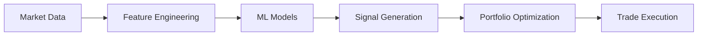

# Full System 다이어그램 모음

이 폴더에는 Letrade_v1 전체 시스템의 고급 기능을 포함한 다이어그램들이 포함되어 있습니다.

## 📊 다이어그램 목록

### 1. 선물 거래 및 레버리지 관리 시퀀스
- **파일**: `futures_trading_sequence.md`
- **타입**: Sequence Diagram
- **설명**: 선물 거래의 동적 레버리지 관리 및 리스크 모니터링 플로우
- **주요 컴포넌트**:
  - `LeverageManager`: 동적 레버리지 계산
  - `MarginCalculator`: 증거금 및 청산가격 계산
  - `LiquidationMonitor`: 실시간 청산 리스크 모니터링
- **핵심 기능**:
  - 변동성 기반 레버리지 조정
  - 자동 증거금 관리
  - 펀딩비 차익거래
  - 델타 중립 헤징

### 2. 전체 시스템 클래스 다이어그램
- **파일**: `full_system_class.md`
- **타입**: UML Class Diagram
- **설명**: AI/ML, 스테이킹, 고급 리스크 관리를 포함한 전체 시스템 클래스 구조
- **확장된 기능**:
  - **AI/ML 컴포넌트**: RLAgent, PricePredictionModel, MarketRegimeClassifier
  - **고급 전략**: GridTradingStrategy, DCAStrategy, ArbitrageStrategy
  - **리스크 관리**: VaRCalculator, StressTestEngine
  - **인프라**: MLPipeline, BacktestEngine, HighAvailabilityManager

## 🚀 고급 기능 카테고리

### AI/ML 거래 시스템

### 멀티 에셋 전략
- **현물 거래**: 기본 매매 전략
- **선물 거래**: 레버리지 및 헤징 전략
- **스테이킹**: DeFi 수익 창출
- **차익거래**: 거래소 간 가격 차이 활용

### 리스크 관리 시스템
- **VaR (Value at Risk)**: 포트폴리오 리스크 정량화
- **스트레스 테스트**: 극한 시나리오 시뮬레이션
- **동적 포지션 조정**: 실시간 리스크 기반 포지션 조정

## 🔧 Week별 구현 계획

### Week 2 (Day 8-14): MVP 기능
- 이동평균 교차 전략
- 기본 Capital Manager
- 현물 거래 실행

### Week 3 (Day 15-21): AI/ML 전략
- 강화학습 환경 구축
- RL 에이전트 구현
- 가격 예측 모델

### Week 4 (Day 22-28): 고급 기능
- 선물 거래 및 레버리지 관리
- 스테이킹 모듈
- 고급 리스크 관리

## 📈 성능 및 확장성

### 처리 성능 목표
- **거래 지연시간**: < 200ms (MVP) → < 50ms (Full)
- **동시 전략 실행**: 10개 (MVP) → 100개 (Full)
- **처리량**: 1,000 msg/sec (MVP) → 10,000 msg/sec (Full)

### 확장성 설계
- **마이크로서비스 아키텍처**: 개별 서비스 독립 확장
- **이벤트 기반 통신**: 느슨한 결합으로 시스템 확장 용이
- **클라우드 네이티브**: GCP 관리형 서비스 활용

## 🔄 다이어그램 업데이트 로드맵

### Week 3 업데이트 예정
- **AI/ML 거래 실행 시퀀스**: 강화학습 에이전트의 의사결정 과정
- **모델 학습 파이프라인**: 데이터 전처리부터 모델 배포까지

### Week 4 업데이트 예정
- **스테이킹 및 DeFi 시퀀스**: 자동 복리 및 수익률 최적화
- **고가용성 시스템 다이어그램**: 장애 복구 및 데이터 복제

## 📚 관련 문서

- [전체 통합 기능명세서](../전체%20통합%20기능명세서.md)
- [Capital and Risk Management](../../design-docs/02_Capital_and_Risk_Management.md)
- [Strategy Library and Implementation](../../design-docs/03_Strategy_Library_and_Implementation.md)

## 🎯 실제 구현 상태

**현재 구현 완료** (Day 7):
- ✅ MessageBus 실제 RabbitMQ 통합
- ✅ CoreEngine 기본 구조
- ✅ 실제 인프라 테스트 (10/10 통과)

**다음 구현 대상** (Day 8-9):
- 🔄 BaseStrategy 추상 클래스
- 🔄 MAcrossoverStrategy 구현
- 🔄 StrategyWorker 프로세스