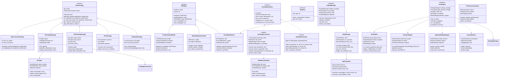

# 전체 시스템 클래스 다이어그램 (고급 기능 포함)

```mermaid
classDiagram
    %% Abstract Base Classes and Interfaces
    class BaseStrategy {
        <<abstract>>
        +dict config
        +PerformanceTracker metrics
        +init(config: dict)
        +populate_indicators(dataframe: DataFrame)*
        +on_data(data: dict, dataframe: DataFrame)*
        +on_data_async(data: dict, dataframe: DataFrame)
        +get_required_subscriptions()*
        +get_performance_metrics()
    }
    
    class ExchangeInterface {
        <<interface>>
        +connect()*
        +execute_trade(order: dict)*
        +fetch_market_data(symbol: str)*
        +get_account_balance()*
        +stake(asset: str, amount: float)*
        +unstake(asset: str, amount: float)*
    }
    
    class MLModel {
        <<abstract>>
        +model_id: UUID
        +version: str
        +train(data: DataFrame)*
        +predict(features: array)*
        +evaluate(test_data: DataFrame)*
        +save_model(path: str)*
        +load_model(path: str)*
    }
    
    class RiskRule {
        <<interface>>
        +rule_type: str
        +check_rule(portfolio: Portfolio)*
        +get_risk_score()*
    }
    
    %% Strategy Implementations
    class MAcrossoverStrategy {
        -int fast_ma_period
        -int slow_ma_period
        +populate_indicators(dataframe: DataFrame)
        +on_data(data: dict, dataframe: DataFrame)
    }
    
    class RLTradingStrategy {
        -RLAgent agent
        -TradingEnvironment env
        -ReplayBuffer buffer
        +train_agent()
        +generate_action(state: array)
        +update_policy(rewards: array)
    }
    
    class GridTradingStrategy {
        -float grid_upper_bound
        -float grid_lower_bound
        -int grid_levels
        -dict active_orders
        +initialize_grid()
        +adjust_grid_dynamically()
        +handle_filled_order(order: dict)
    }
    
    class DCAStrategy {
        -float investment_amount
        -str schedule
        -bool market_adjusted
        +calculate_next_purchase()
        +adjust_amount_by_volatility()
    }
    
    class ArbitrageStrategy {
        -List~Exchange~ exchanges
        -float min_profit_threshold
        +scan_opportunities()
        +execute_arbitrage(opportunity: dict)
    }
    
    %% AI/ML Components
    class RLAgent {
        -NeuralNetwork policy_network
        -NeuralNetwork value_network
        -Optimizer optimizer
        +select_action(state: array)
        +update_networks(batch: dict)
        +save_checkpoint()
    }
    
    class PricePredictionModel {
        -LSTMNetwork lstm_model
        -TransformerModel transformer
        -EnsembleMethod ensemble
        +preprocess_data(data: DataFrame)
        +generate_features()
        +predict_price(horizon: int)
    }
    
    class MarketRegimeClassifier {
        -HMM hmm_model
        -dict regime_definitions
        +classify_current_regime()
        +predict_regime_change()
        +get_regime_parameters()
    }
    
    class PortfolioOptimizer {
        -MPTOptimizer mpt
        -RLPortfolioAgent rl_agent
        -RiskModel risk_model
        +optimize_allocation(constraints: dict)
        +calculate_efficient_frontier()
        +rebalance_portfolio()
    }
    
    %% Core Services (Extended)
    class CoreEngine {
        <<Singleton>>
        -StrategyManager strategy_manager
        -ProcessManager process_manager
        -EventBus event_bus
        -MLPipeline ml_pipeline
        -BacktestEngine backtest_engine
        +start_system()
        +manage_strategies()
        +run_ml_pipeline()
        +coordinate_services()
    }
    
    class CapitalManager {
        <<Singleton>>
        -PortfolioManager portfolio_manager
        -RiskManager risk_manager
        -PositionSizer position_sizer
        -PortfolioOptimizer optimizer
        +allocate_capital(request: dict)
        +optimize_portfolio()
        +calculate_var()
        +enforce_risk_limits()
    }
    
    class ExchangeConnector {
        <<Adapter>>
        -ccxt.Exchange exchange_client
        -RateLimiter rate_limiter
        -OrderManager order_manager
        -WebSocketManager ws_manager
        +execute_spot_trade(order: dict)
        +execute_futures_trade(order: dict)
        +manage_leverage(symbol: str, leverage: int)
        +stream_market_data()
    }
    
    class StakingAbstraction {
        <<Facade>>
        -Map~str,StakingImpl~ implementations
        +stake_asset(chain: str, asset: str, amount: float)
        +claim_rewards(chain: str, asset: str)
        +get_staking_apr(chain: str, asset: str)
        +auto_compound_rewards()
    }
    
    %% Risk Management Components
    class RiskManager {
        -List~RiskRule~ rules
        -VaRCalculator var_calculator
        -StressTestEngine stress_test
        +calculate_portfolio_risk()
        +run_stress_test(scenario: dict)
        +get_risk_metrics()
        +trigger_risk_alert(alert: dict)
    }
    
    class VaRCalculator {
        -HistoricalVaR historical
        -ParametricVaR parametric
        -MonteCarloVaR monte_carlo
        +calculate_var(confidence: float, horizon: int)
        +calculate_cvar(confidence: float)
    }
    
    %% Infrastructure Services
    class MLPipeline {
        -DataPreprocessor preprocessor
        -FeatureEngineer feature_engineer
        -ModelTrainer trainer
        -ModelRegistry registry
        +run_training_pipeline(config: dict)
        +deploy_model(model_id: UUID)
        +monitor_model_performance()
    }
    
    class BacktestEngine {
        -HistoricalDataLoader data_loader
        -SimulationEngine simulator
        -PerformanceAnalyzer analyzer
        +run_backtest(strategy: BaseStrategy, period: str)
        +generate_report()
        +optimize_parameters()
    }
    
    class StateReconciliation {
        -DatabaseState db_state
        -ExchangeState exchange_state
        -ConflictResolver resolver
        +reconcile()
        +detect_discrepancies()
        +auto_resolve_conflicts()
    }
    
    class HighAvailabilityManager {
        -HealthChecker health_checker
        -FailoverCoordinator failover
        -DataReplicator replicator
        +monitor_system_health()
        +initiate_failover()
        +verify_data_consistency()
    }
    
    %% Monitoring and Analytics
    class PerformanceAnalyzer {
        -MetricsCollector metrics
        -ReportGenerator reports
        -AlertingEngine alerts
        +analyze_strategy_performance()
        +generate_daily_report()
        +detect_anomalies()
    }
    
    class SystemMonitor {
        -PrometheusClient prometheus
        -GrafanaAPI grafana
        -LogAggregator logs
        +collect_metrics()
        +create_dashboard()
        +analyze_logs()
    }
    
    %% Relationships
    BaseStrategy <|-- MAcrossoverStrategy
    BaseStrategy <|-- RLTradingStrategy
    BaseStrategy <|-- GridTradingStrategy
    BaseStrategy <|-- DCAStrategy
    BaseStrategy <|-- ArbitrageStrategy
    
    MLModel <|-- PricePredictionModel
    MLModel <|-- MarketRegimeClassifier
    MLModel <|-- PortfolioOptimizer
    
    ExchangeInterface <|.. ExchangeConnector
    ExchangeInterface <|.. StakingAbstraction
    
    CoreEngine --> StrategyManager
    CoreEngine --> MLPipeline
    CoreEngine --> BacktestEngine
    
    CapitalManager --> RiskManager
    CapitalManager --> PortfolioOptimizer
    RiskManager --> VaRCalculator
    
    RLTradingStrategy --> RLAgent
    RLTradingStrategy --> TradingEnvironment
    
    ExchangeConnector ..> StateReconciliation
    
    CoreEngine ..> HighAvailabilityManager
    CoreEngine ..> SystemMonitor
```