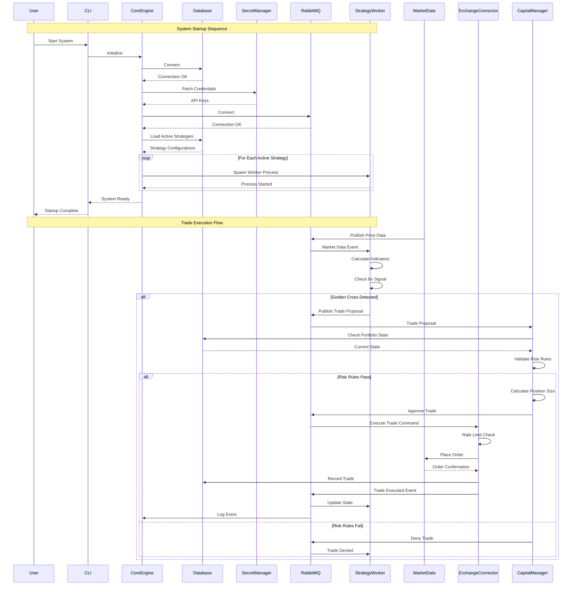

# MVP 시퀀스 다이어그램

## 시스템 시작 및 거래 실행 흐름

```mermaid
sequenceDiagram
    %% 1. System Startup Sequence
    participant User
    participant CLI
    participant CoreEngine
    participant Database
    participant SecretManager
    participant RabbitMQ
    participant StrategyWorker
    
    Note over User,StrategyWorker: System Startup Sequence
    User->>CLI: Start System
    CLI->>CoreEngine: Initialize
    CoreEngine->>Database: Connect
    Database-->>CoreEngine: Connection OK
    CoreEngine->>SecretManager: Fetch Credentials
    SecretManager-->>CoreEngine: API Keys
    CoreEngine->>RabbitMQ: Connect
    RabbitMQ-->>CoreEngine: Connection OK
    CoreEngine->>Database: Load Active Strategies
    Database-->>CoreEngine: Strategy Configurations
    loop For Each Active Strategy
        CoreEngine->>StrategyWorker: Spawn Worker Process
        StrategyWorker-->>CoreEngine: Process Started
    end
    CoreEngine-->>CLI: System Ready
    CLI-->>User: Startup Complete

    %% 2. Trade Execution Flow
    Note over User,StrategyWorker: Trade Execution Flow
    participant MarketData
    participant ExchangeConnector
    participant CapitalManager
    
    MarketData->>RabbitMQ: Publish Price Data
    RabbitMQ->>StrategyWorker: Market Data Event
    StrategyWorker->>StrategyWorker: Calculate Indicators
    StrategyWorker->>StrategyWorker: Check for Signal
    alt Golden Cross Detected
        StrategyWorker->>RabbitMQ: Publish Trade Proposal
        RabbitMQ->>CapitalManager: Trade Proposal
        CapitalManager->>Database: Check Portfolio State
        Database-->>CapitalManager: Current State
        CapitalManager->>CapitalManager: Validate Risk Rules
        alt Risk Rules Pass
            CapitalManager->>CapitalManager: Calculate Position Size
            CapitalManager->>RabbitMQ: Approve Trade
            RabbitMQ->>ExchangeConnector: Execute Trade Command
            ExchangeConnector->>ExchangeConnector: Rate Limit Check
            ExchangeConnector->>MarketData: Place Order
            MarketData-->>ExchangeConnector: Order Confirmation
            ExchangeConnector->>Database: Record Trade
            ExchangeConnector->>RabbitMQ: Trade Executed Event
            RabbitMQ->>StrategyWorker: Update State
            RabbitMQ->>CoreEngine: Log Event
        else Risk Rules Fail
            CapitalManager->>RabbitMQ: Deny Trade
            RabbitMQ->>StrategyWorker: Trade Denied
        end
    end
```