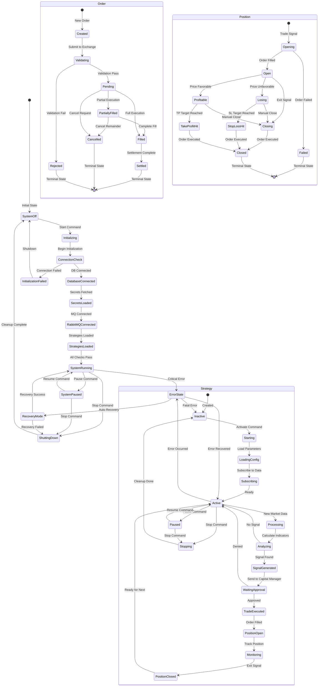

# MVP 상태 다이어그램

```mermaid
stateDiagram-v2
    %% 1. System State Diagram
    [*] --> SystemOff: Initial State
    
    SystemOff --> Initializing: Start Command
    
    Initializing --> ConnectionCheck: Begin Initialization
    ConnectionCheck --> DatabaseConnected: DB Connected
    ConnectionCheck --> InitializationFailed: Connection Failed
    
    DatabaseConnected --> SecretsLoaded: Secrets Fetched
    SecretsLoaded --> RabbitMQConnected: MQ Connected
    RabbitMQConnected --> StrategiesLoaded: Strategies Loaded
    
    StrategiesLoaded --> SystemRunning: All Checks Pass
    InitializationFailed --> SystemOff: Shutdown
    
    SystemRunning --> SystemPaused: Pause Command
    SystemPaused --> SystemRunning: Resume Command
    
    SystemRunning --> ShuttingDown: Stop Command
    SystemPaused --> ShuttingDown: Stop Command
    ShuttingDown --> SystemOff: Cleanup Complete
    
    SystemRunning --> ErrorState: Critical Error
    ErrorState --> RecoveryMode: Auto Recovery
    RecoveryMode --> SystemRunning: Recovery Success
    RecoveryMode --> ShuttingDown: Recovery Failed

    %% 2. Strategy State Diagram
    state Strategy {
        [*] --> Inactive: Created
        
        Inactive --> Starting: Activate Command
        Starting --> LoadingConfig: Load Parameters
        LoadingConfig --> Subscribing: Subscribe to Data
        Subscribing --> Active: Ready
        
        Active --> Processing: New Market Data
        Processing --> Analyzing: Calculate Indicators
        Analyzing --> SignalGenerated: Signal Found
        Analyzing --> Active: No Signal
        
        SignalGenerated --> WaitingApproval: Send to Capital Manager
        WaitingApproval --> TradeExecuted: Approved
        WaitingApproval --> Active: Denied
        
        TradeExecuted --> PositionOpen: Order Filled
        PositionOpen --> Monitoring: Track Position
        Monitoring --> PositionClosed: Exit Signal
        PositionClosed --> Active: Ready for Next
        
        Active --> Paused: Pause Command
        Paused --> Active: Resume Command
        
        Active --> Stopping: Stop Command
        Paused --> Stopping: Stop Command
        Stopping --> Inactive: Cleanup Done
        
        Active --> ErrorState: Error Occurred
        ErrorState --> Inactive: Fatal Error
        ErrorState --> Active: Error Recovered
    }

    %% 3. Order State Diagram
    state Order {
        [*] --> Created: New Order
        
        Created --> Validating: Submit to Exchange
        Validating --> Pending: Validation Pass
        Validating --> Rejected: Validation Fail
        
        Pending --> PartiallyFilled: Partial Execution
        Pending --> Filled: Full Execution
        Pending --> Cancelled: Cancel Request
        
        PartiallyFilled --> Filled: Complete Fill
        PartiallyFilled --> Cancelled: Cancel Remainder
        
        Filled --> Settled: Settlement Complete
        Rejected --> [*]: Terminal State
        Cancelled --> [*]: Terminal State
        Settled --> [*]: Terminal State
    }

    %% 4. Position State Diagram
    state Position {
        [*] --> Opening: Trade Signal
        
        Opening --> Open: Order Filled
        Opening --> Failed: Order Failed
        
        Open --> Profitable: Price Favorable
        Open --> Losing: Price Unfavorable
        
        Profitable --> TakeProfitHit: TP Target Reached
        Losing --> StopLossHit: SL Target Reached
        
        Open --> Closing: Exit Signal
        Profitable --> Closing: Manual Close
        Losing --> Closing: Manual Close
        
        TakeProfitHit --> Closed: Order Executed
        StopLossHit --> Closed: Order Executed
        Closing --> Closed: Order Executed
        
        Failed --> [*]: Terminal State
        Closed --> [*]: Terminal State
    }
```