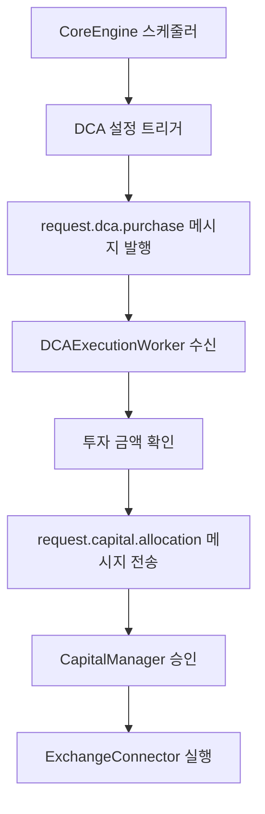

# 전략 라이브러리 및 구현 (Strategy Library and Implementation)

## 📋 문서 개요

**문서 목적**: 자동 암호화폐 거래 시스템에서 실행 가능한 모든 투자 및 거래 전략의 구현 세부 사항을 담은 공식 "플레이북"

**대상 독자**: 퀀트 개발자 (시스템 내부 동작 이해 없이도 새로운 거래 아이디어를 신속하게 프로토타이핑 및 통합 가능)

**시스템 설계 활용**:
- **모듈식 아키텍처**: BaseStrategy 인터페이스 기반
- **신속한 개발**: 이론적 배경, 핵심 클래스 구조, 실제 코드 예시 제공

**전략 범위**:
- 🔄 **고전적 기술적 분석** 기반 전략
- 🤖 **최신 AI 강화학습** 모델
- 📅 **DCA 및 그리드 거래** 같은 상태 저장형(stateful) 투자 전략
- 🎯 **고급 퀀트 전략** (백테스팅, A/B 테스팅, 성과 분석)

---

## 📊 1. 기술적 분석(TA) 기반 전략

### 1.1 이론적 배경

**기술적 분석 정의**: 과거의 가격 및 거래량 데이터를 분석하여 미래의 가격 움직임을 예측하는 방법론

**시스템 통합**: BaseStrategy 인터페이스를 통해 TA 기반 전략을 쉽게 추가하고 실행

### 1.2 핵심 철학: 추세 추종 vs 평균 회귀

#### 🔺 **추세 추종 (Trend Following)**
**목표**: 시장이 특정 방향으로의 모멘텀을 가질 때 수익 창출

**대표 전략**:
- 이동평균 교차(Moving Average Crossover)
- MACD 신호선 교차

**동작 원리**:
- 상승/하락 추세의 **초기에 진입**
- 추세가 지속되는 동안 **포지션 유지**

#### 🔻 **평균 회귀 (Mean Reversion)**
**목표**: 가격이 장기적인 평균으로 되돌아가려는 경향에 베팅

**대표 전략**:
- RSI(상대강도지수) 활용
- 볼린저 밴드(Bollinger Bands) 활용

**동작 원리**:
- **과매수** (RSI > 70) 또는 **과매도** (RSI < 30) 상태 감지
- 반대 방향 포지션으로 **단기적 가격 조정** 수익화

### 1.3 구현 사례: 이동평균 교차 전략

#### 1.3.1 전략 로직

**매수 신호**: 
- **Golden Cross**: 단기 이동평균선(예: 50일)이 장기 이동평균선(예: 200일)을 상향 돌파
- **의미**: 상승 추세의 시작 신호

**매도 신호**:
- **Death Cross**: 단기 이동평균선이 장기 이동평균선을 하향 돌파  
- **의미**: 하락 추세의 시작 신호

#### 1.3.2 기술 스택: pandas-ta 라이브러리

**선택 이유**: 
- ✅ Pandas DataFrame의 확장(extension)으로 작동
- ✅ 직관적인 API 제공: `df.ta.sma(length=50)`
- ✅ 검증된 라이브러리로 구현 효율성과 정확성 보장

#### 1.3.3 완전한 구현 예시

```python
# /app/strategies/ma_cross_strategy.py

import pandas as pd
import pandas_ta as ta
from app.strategies.base_strategy import BaseStrategy

class MovingAverageCrossStrategy(BaseStrategy):
    """
    단순 이동평균(SMA) 골든/데스 크로스를 기반으로 하는 추세 추종 전략.
    """
    def __init__(self, config: dict):
        """
        전략을 초기화합니다.
        config 딕셔너리에는 'fast_ma_period'와 'slow_ma_period'가 포함되어야 합니다.
        """
        super().__init__(config)
        self.fast_ma_period = int(self.config['parameters'].get('fast', 50))
        self.slow_ma_period = int(self.config['parameters'].get('slow', 200))

    def get_required_subscriptions(self) -> list[str]:
        """
        이 전략이 구독해야 할 RabbitMQ 라우팅 키 목록을 반환합니다.
        설정에서 거래소와 심볼을 동적으로 가져옵니다.
        """
        exchange = self.config['exchange']
        symbol = self.config['symbol'].replace('/', '').lower()
        return [f"market_data.{exchange}.{symbol}"]

    def populate_indicators(self, dataframe: pd.DataFrame) -> pd.DataFrame:
        """
        데이터프레임에 단기 및 장기 단순 이동평균(SMA) 지표를 추가합니다.
        pandas-ta 라이브러리를 사용하여 간결하게 구현합니다.
        """
        if dataframe.empty:
            return dataframe

        # 단기 SMA 계산
        dataframe[f'sma_{self.fast_ma_period}'] = ta.sma(dataframe['close'], length=self.fast_ma_period)
        
        # 장기 SMA 계산
        dataframe[f'sma_{self.slow_ma_period}'] = ta.sma(dataframe['close'], length=self.slow_ma_period)
        
        return dataframe

    def on_data(self, data: dict, dataframe: pd.DataFrame) -> dict | None:
        """
        새로운 데이터가 들어올 때마다 호출되는 핵심 로직.
        골든 크로스 또는 데스 크로스 발생 시 거래 '제안'을 반환합니다.
        """
        if len(dataframe) < self.slow_ma_period:
            # 충분한 데이터가 쌓일 때까지 거래하지 않음
            return None

        # 최신 두 개의 캔들 데이터에 접근
        last_candle = dataframe.iloc[-1]
        previous_candle = dataframe.iloc[-2]

        fast_ma_col = f'sma_{self.fast_ma_period}'
        slow_ma_col = f'sma_{self.slow_ma_period}'

        # 골든 크로스 (매수 신호) 확인: 단기 MA가 장기 MA를 상향 돌파
        if (previous_candle[fast_ma_col] < previous_candle[slow_ma_col] and
            last_candle[fast_ma_col] > last_candle[slow_ma_col]):
            
            print(f"매수 신호 발생: {self.config['symbol']} at {last_candle['close']}")
            return {
                "side": "buy",
                "signal_price": last_candle['close'],
                "stop_loss_price": last_candle['low'] * 0.98, # 예시: 최근 저점의 2% 아래
                "strategy_params": {"signal_type": "golden_cross"}
            }

        # 데스 크로스 (매도 신호) 확인: 단기 MA가 장기 MA를 하향 돌파
        elif (previous_candle[fast_ma_col] > previous_candle[slow_ma_col] and
              last_candle[fast_ma_col] < last_candle[slow_ma_col]):
              
            print(f"매도 신호 발생: {self.config['symbol']} at {last_candle['close']}")
            return {
                "side": "sell",
                "signal_price": last_candle['close'],
                "stop_loss_price": last_candle['high'] * 1.02, # 예시: 최근 고점의 2% 위
                "strategy_params": {"signal_type": "death_cross"}
            }

        # 신호가 없을 경우
        return None
```

#### 🔑 **중요 설계 특징**
- **Capital Manager 호환**: 거래 실행 명령 대신 자본 할당을 위한 '거래 제안' 딕셔너리 반환
- **동적 설정**: 데이터베이스 설정에서 거래소와 심볼을 동적으로 가져옴
- **안전 장치**: 충분한 데이터가 쌓일 때까지 거래하지 않음

---

## 🤖 2. AI 기반 고급 전략: 강화학습 (Reinforcement Learning)

### 2.1 강화학습 개념

**핵심 차별점**: 가격을 직접 예측하는 대신, 주어진 시장 상황에서 어떤 행동(매수, 매도, 홀드)이 **장기적으로 가장 높은 수익**을 가져올지를 직접 학습하는 고급 AI 기법

### 2.2 금융에서의 강화학습 구성요소

#### 🎯 **핵심 구성요소**

| 구성요소 | 정의 | 금융 시장 적용 |
|----------|------|----------------|
| **에이전트 (Agent)** | 의사결정 주체 | 우리의 거래 봇 |
| **환경 (Environment)** | 상호작용 대상 | 시장 그 자체 |
| **상태 (State)** | 관찰 정보 집합 | 다차원 벡터: 가격 데이터, 기술적 지표, 포트폴리오 상태, 미실현 손익 |
| **행동 (Action)** | 가능한 행동 집합 | [매수, 매도, 홀드]의 이산적 행동 |
| **보상 (Reward)** | 행동 피드백 | 샤프 지수 같은 위험 조정 수익률, 큰 손실 패널티 |

#### 💡 **고급 보상 설계**
- ❌ **단순 수익률**: 위험 고려 부족
- ✅ **샤프 지수**: 위험 조정 수익률 사용
- ✅ **패널티 시스템**: 큰 손실에 대한 패널티로 안정적 정책 학습

### 2.3 구현: stable-baselines3 통합

#### 2.3.1 기술 스택
- **stable-baselines3**: 최신 RL 알고리즘의 안정적 구현 라이브러리
- **gymnasium**: 구 OpenAI Gym 인터페이스
- **커스텀 환경**: StockTradingEnv 클래스 구현 필요

#### 2.3.2 StockTradingEnv 클래스 구조

**필수 메서드**:

```python
class StockTradingEnv(gym.Env):
    def __init__(self, df, initial_balance, ...):
        """환경 초기화, action_space와 observation_space 정의"""
        pass
    
    def reset(self):
        """에피소드 초기화, 첫 번째 관찰(state) 반환"""
        pass
    
    def step(self, action):
        """
        에이전트 행동 실행
        반환: 다음 상태, 보상, 에피소드 종료 여부
        포함: 모든 거래 로직과 손익 계산
        """
        pass
```

#### 2.3.3 시스템 통합 프로세스

#### **1단계: 학습 (오프라인)**
```python
# stable-baselines3와 커스텀 환경으로 에이전트 학습
model.learn(total_timesteps=100000)
model.save("ppo_model.zip")
```

#### **2단계: 통합 (온라인)**
```python
class RLStrategy(BaseStrategy):
    def __init__(self, config):
        super().__init__(config)
        # 학습된 모델 로드
        self.model = PPO.load("ppo_model.zip")
    
    def on_data(self, data, dataframe):
        # 1. 현재 시장 데이터 + 포트폴리오 상태 → 관찰(state) 벡터 생성
        state = self._create_state_vector(data, dataframe)
        
        # 2. 모델로부터 최적 행동 예측
        action, _ = self.model.predict(state)
        
        # 3. 예측된 행동에 따라 거래 제안 반환
        return self._action_to_trade_proposal(action)
```

#### 🎯 **RL 전략의 잠재력**
**장점**: 기존 규칙 기반 전략으로는 포착하기 어려운 **복잡하고 비선형적인 시장 패턴**에 대응 가능

---

## 📅 3. 상태 저장형 및 스케줄링 기반 전략

### 3.1 개요

**목표**: 단순한 신호 기반 거래를 넘어, **특정 시간**이나 **내부 상태**에 따라 동작하는 고급 투자 전략 지원

### 3.2 적립식 투자(DCA) 모듈

#### 3.2.1 DCA 전략 개념
**목표**: 정해진 시간에 정해진 금액을 꾸준히 투자하여 **시장 변동성에 대한 노출을 평균화**

#### 3.2.2 로직 및 실행 흐름



**상세 단계**:

1. **스케줄링**: CoreEngine 내 스케줄러(apscheduler)가 데이터베이스 DCAStrategy 설정에 따라 작업 트리거 (예: 매주 월요일 09:00)

2. **메시지 발행**: 트리거 시점에 CoreEngine이 `request.dca.purchase` 메시지를 해당 strategy_id와 함께 RabbitMQ에 발행

3. **전용 워커**: DCAExecutionWorker가 메시지 구독하고 전략 파라미터에서 투자 금액 조회

4. **자본 요청**: 워커가 투자 금액 정보를 담아 `request.capital.allocation` 메시지를 CapitalManager에 전송

5. **실행**: CapitalManager 승인 후 최종 주문을 ExchangeConnector로 전달하여 실행

### 3.3 그리드(Grid) 거래 모듈

#### 3.3.1 그리드 거래 개념
**목표**: 특정 가격 범위 내에서 미리 설정된 여러 가격대에 매수 및 매도 주문을 배치하여, **가격 변동성을 이용해 작은 수익을 반복적으로 축적**

#### 3.3.2 상태 관리 (핵심 과제)

**핵심 도전**: 시스템 재시작 시에도 그리드 상태를 완벽하게 유지

#### **1. 데이터베이스 영속화**
```sql
-- grid_orders 전용 테이블
CREATE TABLE grid_orders (
    id SERIAL PRIMARY KEY,
    strategy_id INTEGER,
    grid_level INTEGER,
    order_type VARCHAR(10), -- 'buy' or 'sell'
    price NUMERIC(20, 8),
    amount NUMERIC(20, 8),
    status VARCHAR(20), -- 'active', 'filled', 'cancelled'
    exchange_order_id VARCHAR(100)
);
```

#### **2. 초기화 및 상태 조정**
```python
def reconcile_grid_state():
    # 1. grid_orders 테이블 상태 조회
    db_orders = get_grid_orders_from_db()
    
    # 2. ExchangeConnector를 통해 실제 거래소 미체결 주문 조회
    exchange_orders = get_open_orders_from_exchange()
    
    # 3. 상태 비교 및 조정
    for db_order in db_orders:
        if db_order not in exchange_orders:
            # 상태 불일치 발견 시 조정
            update_order_status(db_order.id, 'cancelled')
```

#### **3. 이벤트 기반 재설정**
```python
class GridStrategy(BaseStrategy):
    def __init__(self, config):
        super().__init__(config)
        # events.trade_executed 큐 구독
        self.subscribe_to_trade_events()
    
    def on_trade_executed(self, trade_event):
        if trade_event['strategy_id'] == self.strategy_id:
            # 그리드 레벨 n 매수 주문 체결 시
            if trade_event['side'] == 'buy':
                # 1. grid_orders 테이블 상태 업데이트
                self.update_grid_order_status(trade_event['order_id'], 'filled')
                
                # 2. 그리드 레벨 n+1에 새로운 매도 주문 생성 요청
                self.request_new_sell_order(grid_level=trade_event['grid_level'] + 1)
```

#### **4. 리스크 관리**
```python
def check_grid_boundaries(current_price):
    if current_price > self.grid_upper_bound or current_price < self.grid_lower_bound:
        # 가격이 설정된 그리드 범위를 벗어난 경우
        self.close_all_positions()
        self.stop_grid_strategy()
        self.send_alert("Grid boundary exceeded - Strategy stopped")
```

**리스크 관리 요소**:
- ✅ **범위 이탈 감지**: 가격이 그리드 범위를 벗어나는 경우 자동 감지
- ✅ **자동 정리**: 모든 포지션 정리 후 그리드 종료
- ✅ **손실 방지**: 전략 파라미터에 대응 방안 사전 정의

---

## 🎯 4. 고급 전략 기능 (신규 추가)

### 4.1 실시간 백테스팅 엔진

**목적**: 새로운 전략을 실제 자금으로 실행하기 전에 실시간 시장 데이터로 검증

```python
class RealTimeBacktester:
    def __init__(self, strategy_class, config, initial_capital=10000):
        self.strategy = strategy_class(config)
        self.virtual_portfolio = VirtualPortfolio(initial_capital)
        self.performance_tracker = PerformanceTracker()
        
    async def run_parallel_test(self, duration_days=30):
        """
        실제 전략과 병렬로 가상 백테스팅 실행
        """
        start_time = time.time()
        end_time = start_time + (duration_days * 24 * 3600)
        
        while time.time() < end_time:
            # 실시간 시장 데이터 수신
            market_data = await self.get_live_market_data()
            
            # 전략 신호 생성 (실제 거래 없음)
            signal = self.strategy.on_data(market_data, self.get_historical_data())
            
            if signal:
                # 가상 포트폴리오에서 거래 시뮬레이션
                virtual_result = self.virtual_portfolio.execute_virtual_trade(signal)
                self.performance_tracker.record_trade(virtual_result)
            
            await asyncio.sleep(1)  # 1초마다 체크
        
        return self.generate_backtest_report()
    
    def generate_backtest_report(self) -> dict:
        """
        백테스팅 결과 종합 보고서 생성
        """
        return {
            'total_return': self.virtual_portfolio.total_return,
            'sharpe_ratio': self.performance_tracker.calculate_sharpe_ratio(),
            'max_drawdown': self.performance_tracker.max_drawdown,
            'win_rate': self.performance_tracker.win_rate,
            'total_trades': self.performance_tracker.total_trades,
            'avg_trade_duration': self.performance_tracker.avg_trade_duration
        }
```

### 4.2 전략 성과 분석 도구

**목적**: 실행 중인 전략의 성과를 다각도로 분석하고 최적화 포인트 제시

```python
class StrategyPerformanceAnalyzer:
    def __init__(self, strategy_id):
        self.strategy_id = strategy_id
        self.trade_analyzer = TradeAnalyzer()
        self.risk_analyzer = RiskAnalyzer()
        
    def generate_comprehensive_report(self, period_days=30) -> dict:
        """
        전략의 종합 성과 분석 보고서 생성
        """
        trades = self.get_strategy_trades(period_days)
        
        return {
            'profitability_analysis': self.analyze_profitability(trades),
            'risk_analysis': self.analyze_risk_metrics(trades),
            'market_timing_analysis': self.analyze_market_timing(trades),
            'optimization_suggestions': self.generate_optimization_suggestions(trades),
            'correlation_analysis': self.analyze_market_correlation(trades)
        }
    
    def analyze_profitability(self, trades) -> dict:
        """
        수익성 분석
        """
        winning_trades = [t for t in trades if t['pnl'] > 0]
        losing_trades = [t for t in trades if t['pnl'] < 0]
        
        return {
            'win_rate': len(winning_trades) / len(trades) if trades else 0,
            'profit_factor': sum(t['pnl'] for t in winning_trades) / abs(sum(t['pnl'] for t in losing_trades)) if losing_trades else float('inf'),
            'avg_win': sum(t['pnl'] for t in winning_trades) / len(winning_trades) if winning_trades else 0,
            'avg_loss': sum(t['pnl'] for t in losing_trades) / len(losing_trades) if losing_trades else 0,
            'largest_win': max((t['pnl'] for t in winning_trades), default=0),
            'largest_loss': min((t['pnl'] for t in losing_trades), default=0)
        }
    
    def generate_optimization_suggestions(self, trades) -> list:
        """
        성과 데이터 기반 최적화 제안 생성
        """
        suggestions = []
        
        # 손절매 분석
        if self.analyze_stop_loss_effectiveness(trades) < 0.5:
            suggestions.append({
                'type': 'stop_loss_optimization',
                'message': '현재 손절매 설정이 비효율적입니다. 더 타이트한 손절매를 고려해보세요.',
                'suggested_change': 'reduce_stop_loss_distance_by_20_percent'
            })
        
        # 시장 타이밍 분석
        timing_score = self.analyze_market_timing_score(trades)
        if timing_score < 0.3:
            suggestions.append({
                'type': 'market_timing',
                'message': '시장 타이밍이 좋지 않습니다. 추가 필터 조건을 고려해보세요.',
                'suggested_change': 'add_volume_filter_or_volatility_filter'
            })
        
        return suggestions
```

### 4.3 A/B 테스팅 프레임워크

**목적**: 동일한 전략의 서로 다른 파라미터 버전을 동시에 실행하여 최적 설정 발견

```python
class StrategyABTester:
    def __init__(self, base_strategy_class, test_configurations):
        self.base_strategy_class = base_strategy_class
        self.test_configurations = test_configurations
        self.test_results = {}
        
    async def run_ab_test(self, duration_days=14, capital_split_ratio=0.1):
        """
        A/B 테스트 실행
        """
        # 각 테스트 버전별로 별도의 가상 포트폴리오 생성
        test_portfolios = {}
        for config_name, config in self.test_configurations.items():
            test_portfolios[config_name] = {
                'strategy': self.base_strategy_class(config),
                'portfolio': VirtualPortfolio(10000 * capital_split_ratio),
                'performance': PerformanceTracker()
            }
        
        start_time = time.time()
        end_time = start_time + (duration_days * 24 * 3600)
        
        while time.time() < end_time:
            market_data = await self.get_live_market_data()
            
            # 각 테스트 버전 병렬 실행
            for config_name, test_setup in test_portfolios.items():
                signal = test_setup['strategy'].on_data(market_data, self.get_historical_data())
                
                if signal:
                    result = test_setup['portfolio'].execute_virtual_trade(signal)
                    test_setup['performance'].record_trade(result)
            
            await asyncio.sleep(60)  # 1분마다 체크
        
        return self.analyze_ab_test_results(test_portfolios)
    
    def analyze_ab_test_results(self, test_portfolios) -> dict:
        """
        A/B 테스트 결과 분석 및 승자 결정
        """
        results = {}
        
        for config_name, test_setup in test_portfolios.items():
            results[config_name] = {
                'total_return': test_setup['portfolio'].total_return,
                'sharpe_ratio': test_setup['performance'].calculate_sharpe_ratio(),
                'max_drawdown': test_setup['performance'].max_drawdown,
                'total_trades': test_setup['performance'].total_trades,
                'win_rate': test_setup['performance'].win_rate
            }
        
        # 복합 점수 계산 (샤프 지수 + 승률 가중평균)
        for config_name in results:
            results[config_name]['composite_score'] = (
                results[config_name]['sharpe_ratio'] * 0.6 + 
                results[config_name]['win_rate'] * 0.4
            )
        
        # 최고 성과 설정 식별
        best_config = max(results.keys(), key=lambda k: results[k]['composite_score'])
        
        return {
            'detailed_results': results,
            'winner': best_config,
            'improvement_percentage': self.calculate_improvement_percentage(results),
            'statistical_significance': self.calculate_statistical_significance(results)
        }
```

### 4.4 동적 파라미터 최적화

**목적**: 시장 조건 변화에 따라 전략 파라미터를 자동으로 조정

```python
class DynamicParameterOptimizer:
    def __init__(self, strategy_id, optimization_config):
        self.strategy_id = strategy_id
        self.optimization_config = optimization_config
        self.current_parameters = self.load_current_parameters()
        self.optimization_history = []
        
    async def run_continuous_optimization(self):
        """
        지속적인 파라미터 최적화 실행
        """
        while True:
            # 최근 성과 분석
            recent_performance = await self.analyze_recent_performance()
            
            # 시장 조건 변화 감지
            market_regime_change = await self.detect_market_regime_change()
            
            if self.should_optimize(recent_performance, market_regime_change):
                # 최적화 실행
                optimized_params = await self.optimize_parameters()
                
                # 새 파라미터 검증
                if await self.validate_new_parameters(optimized_params):
                    await self.apply_new_parameters(optimized_params)
                    self.log_optimization_event(optimized_params)
            
            await asyncio.sleep(3600)  # 1시간마다 체크
    
    async def optimize_parameters(self) -> dict:
        """
        베이지안 최적화를 사용한 파라미터 튜닝
        """
        from skopt import gp_minimize
        from skopt.space import Real, Integer
        
        # 최적화할 파라미터 공간 정의
        space = []
        for param_name, param_config in self.optimization_config.items():
            if param_config['type'] == 'float':
                space.append(Real(param_config['min'], param_config['max'], name=param_name))
            elif param_config['type'] == 'int':
                space.append(Integer(param_config['min'], param_config['max'], name=param_name))
        
        # 목적 함수 정의 (샤프 지수 최대화)
        def objective(params):
            param_dict = dict(zip([s.name for s in space], params))
            return -self.evaluate_parameter_set(param_dict)  # 최소화 문제로 변환
        
        # 베이지안 최적화 실행
        result = gp_minimize(
            func=objective,
            dimensions=space,
            n_calls=50,  # 50번의 평가
            random_state=42
        )
        
        # 최적 파라미터 반환
        return dict(zip([s.name for s in space], result.x))
```

---

## 🎯 시스템 통합 효과

### 전략 다양성 지원
- ✅ **고전적 기술적 분석**: 검증된 패턴 기반
- ✅ **AI 강화학습**: 복잡한 비선형 패턴 대응
- ✅ **상태 저장형**: 시간 기반 및 내부 상태 기반 전략
- ✅ **고급 퀀트 기능**: 백테스팅, A/B 테스팅, 동적 최적화

### 시스템 유연성
- ✅ **모듈식 설계**: BaseStrategy 인터페이스 기반
- ✅ **신속한 프로토타이핑**: 복잡한 내부 동작 이해 불필요
- ✅ **다양한 투자자 요구**: 모든 수준의 투자 전략 지원
- ✅ **실시간 최적화**: 지속적인 성과 개선

### 플랫폼 진화
**결과**: 시스템의 유연성과 확장성을 보여주며, **다양한 투자자의 요구를 충족시킬 수 있는 강력한 플랫폼**으로의 발전

### 고급 기능의 비즈니스 가치
- **위험 감소**: 실시간 백테스팅으로 실제 자금 손실 위험 최소화
- **성과 향상**: A/B 테스팅과 동적 최적화로 지속적인 수익성 개선
- **경쟁 우위**: AI 기반 분석과 자동 최적화로 시장 대비 우위 확보

---

## 📝 문서 관리 정보

**연관 문서**: 
- `00_System_Overview_and_Architecture.md`
- `01_Core_Services_and_Execution_Framework.md`
- `02_Capital_and_Risk_Management.md`

**구현 가이드**: 각 전략 유형별 완전한 코드 예시 제공
**확장성**: BaseStrategy 인터페이스를 통한 새로운 전략 쉬운 추가
**고급 기능**: 실시간 백테스팅, A/B 테스팅, 동적 최적화 프레임워크 포함