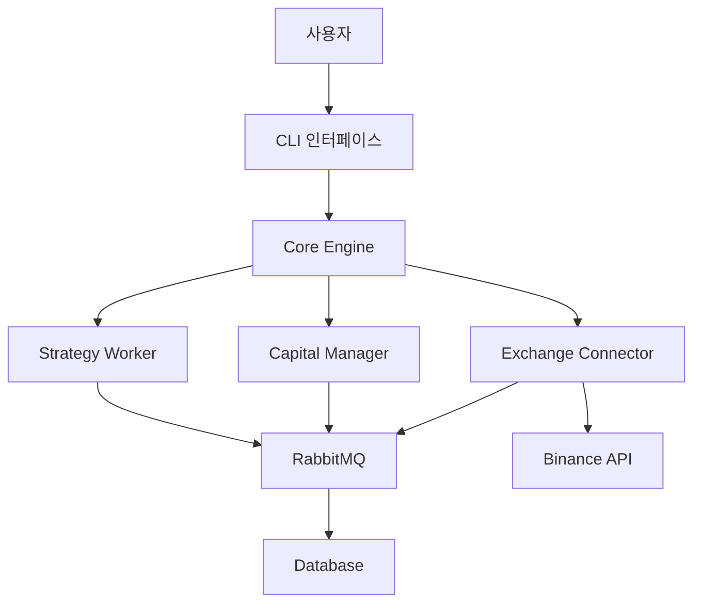

# 간단한 테스트 다이어그램

```mermaid
graph TD
    A[사용자] --> B[CLI 인터페이스]
    B --> C[Core Engine]
    C --> D[Strategy Worker]
    C --> E[Capital Manager]
    C --> F[Exchange Connector]
    
    D --> G[RabbitMQ]
    E --> G
    F --> G
    
    G --> H[Database]
    F --> I[Binance API]
```